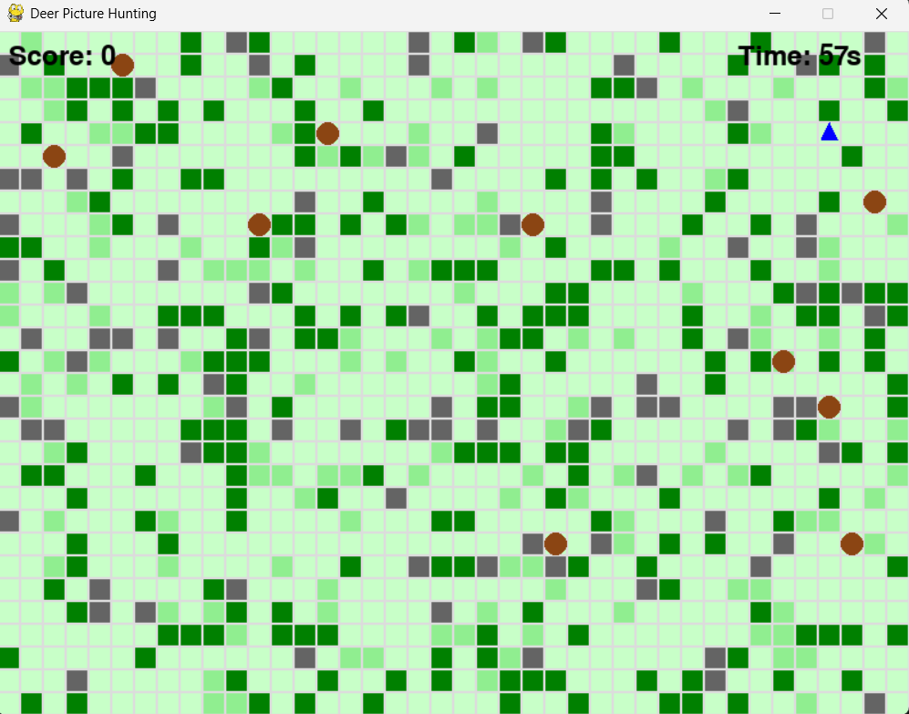
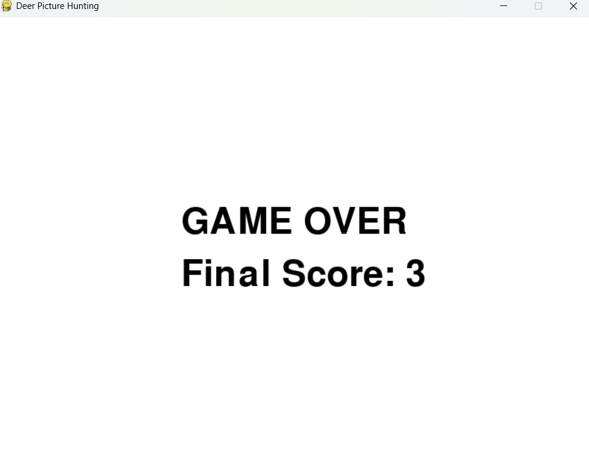
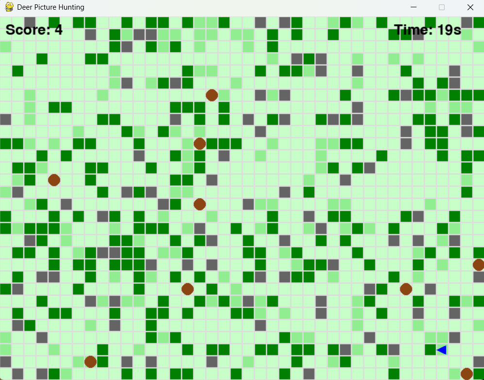

# Deer Picture Hunting Game (2D Grid-Based Version)





A simplified 2D grid-based implementation of the Deer Picture Hunting Game developed for the Advanced Object-Oriented Programming course at TU Wien.

## Table of Contents

- [Overview](#overview)
- [Features](#features)
- [Installation](#installation)
- [How to Play](#how-to-play)
- [Implementation Details](#implementation-details)
- [Code Structure](#code-structure)
- [Development Timeline](#development-timeline)
- [Assignment Context](#assignment-context)
- [Credits](#credits)

## Overview

Deer Picture Hunting Game is a grid-based 2D game where you play as a wildlife photographer attempting to take pictures of deer in a forest environment. The deer react to your presence, attempting to flee when you get too close. Navigate the environment carefully, avoid alerting the deer, and capture as many unique photographs as possible before time runs out.

This version uses a simplified grid-based approach to focus on the core game mechanics and object-oriented programming principles rather than complex graphics and physics.

## Features

- **Grid-based Movement System**: Navigate through the forest using the arrow keys
- **Dynamic Deer AI**: Deer that react to the player's presence and movement
- **Photography Mechanics**: Take pictures in the direction you're facing
- **Varied Environment**: Forest with trees, rocks, and bushes that affect movement and visibility
- **Scoring System**: Points awarded for unique deer photographs
- **Timer-based Gameplay**: Limited time to take as many pictures as possible

## Installation

### Prerequisites
- Python 3.8 or higher
- Pygame library

### Setup

1. Clone the repository:
   ```bash
   git clone https://github.com/MinimalArchitect/deer-picture-hunting-game.git
   cd deer-picture-hunting-game
   ```

2. Create and activate a virtual environment (recommended):
   ```bash
   # Windows
   python -m venv venv
   venv\Scripts\activate
   
   # macOS/Linux
   python -m venv venv
   source venv/bin/activate
   ```

3. Install required packages:
   ```bash
   pip install pygame
   ```

4. Run the game:
   ```bash
   python 2d/main.py
   ```

## How to Play

- **Arrow Keys**: Move your photographer (blue triangle) around the map
- **Space**: Take a picture in the direction you're facing
- **Goal**: Photograph as many unique deer as possible before time runs out
- **Scoring**: Each unique deer photographed awards 1 point

### Environment Elements

- **Green Squares**: Trees (block movement and vision)
- **Gray Squares**: Rocks (block movement and vision)
- **Light Green Squares**: Bushes (allow movement but reduce visibility)
- **Brown Circles**: Deer (your photography targets)
- **Blue Triangle**: Player (points in the direction you're facing)

## Implementation Details

The game is implemented using Pygame and employs object-oriented programming principles:

- **Inheritance**: All game entities inherit from a base GameObject class
- **Encapsulation**: Game state and behavior are encapsulated within appropriate classes
- **Polymorphism**: Different entities implement their own draw() and update() methods
- **Abstraction**: Complex behaviors are abstracted into methods

The game uses a simple grid-based collision system and implements basic AI for the deer to detect and flee from the player.

## Code Structure

```
2d/
├── main.py          # Main game file containing all classes and game loop
├── assets/          # Game assets (if any)
    └── ...
```

### Classes Overview

- **GameObject**: Base class for all game objects
- **Player**: Handles player movement, direction, and photography
- **Deer**: Implements deer behavior, movement, and reaction to player
- **GameMap**: Manages the game environment and obstacles
- **Game**: Main game class that brings everything together

## Development Timeline

This 2D grid-based version represents the first phase of a three-part project:

1. **Python Implementation (Current)**: Simplified 2D grid-based version
2. **Smalltalk Implementation (Upcoming)**: Port of the game to Smalltalk
3. **Eiffel Implementation (Upcoming)**: Final version implemented in Eiffel

Each implementation aims to explore the object-oriented features of the respective language.

## Assignment Context

This game is developed as part of the "Advanced Object-Oriented Programming" course at TU Wien. The assignment involves creating three versions of the same game in different object-oriented languages:

1. A networked version in any OOP language (we chose Python with a simplified 2D approach)
2. A simplified version in Smalltalk
3. A version in Eiffel exploring its specific features


---

*Note: This README describes the simplified 2D grid-based version of the Deer Picture Hunting Game. Future implementations in Smalltalk and Eiffel will build upon the concepts established here.*
