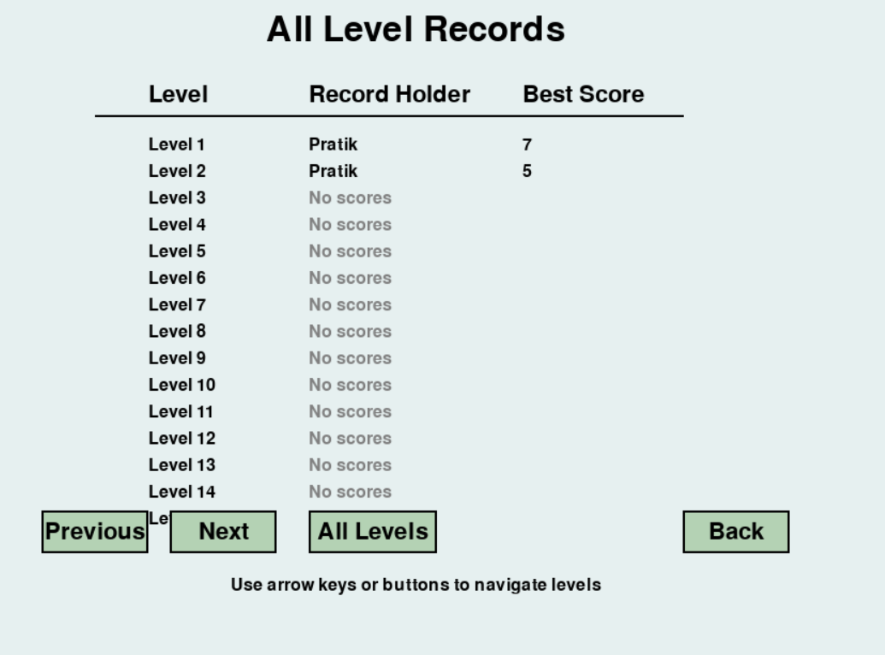

# Deer Picture Hunting Game (2D Grid-Based Version)

<table>
  <tr>
    <td></td>
    <td></td>
  </tr>
  <tr>
    <td align="center">Main Menu</td>
    <td align="center">Gameplay</td>
  </tr>
  <tr>
    <td></td>
    <td></td>
    <td></td>
  </tr>
  <tr>
    <td align="center">Gameplay with flickering hounter</td>
    <td align="center">Name dialog box</td>
    <td align="center">Game Over/New Record</td>
  </tr>
<tr>
    <td></td>
    <td></td>
  </tr>
  <tr>
    <td align="center">Choose Level Preview</td>
    <td align="center">Options menu</td>
  </tr>
<tr>
    <td></td>
    <td></td>
    <td></td>
  </tr>
  <tr>
    <td align="center">Scores - Level-1</td>
    <td align="center">Scores - Level-2</td>
    <td align="center">High Scores - all levels</td>
  </tr>
</table>

A simplified 2D grid-based implementation of the Deer Picture Hunting Game developed for the Advanced Object-Oriented Programming course at TU Wien.

## Table of Contents

- [Overview](#overview)
- [Features](#features)
- [Installation](#installation)
- [How to Play](#how-to-play)
- [Implementation Details](#implementation-details)
- [Code Structure](#code-structure)
- [Development Timeline](#development-timeline)
- [Assignment Context](#assignment-context)

## Overview

Deer Picture Hunting Game is a grid-based 2D game where you play as a wildlife photographer attempting to take pictures of deer in a forest environment. The deer react to your presence, attempting to flee when you get too close. Navigate the environment carefully, avoid alerting the deer, and capture as many unique photographs as possible before time runs out.

This version uses a simplified grid-based approach to focus on the core game mechanics and object-oriented programming principles rather than complex graphics and physics.

It implements:
- 20 predefined levels of increasing difficulty
- Score tracking and persistence across sessions
- A complete GUI with options and level selection
- Animated hunter highlighting at spawn


## Features

- 🎮 **Single Player Mode**
- 🗺️ **20 Predefined Levels** with increasing difficulty
- 🦌 **Dynamic Deer AI**: Reacts to proximity with alert and flee behaviors
- 📸 **Photography Mechanic**: Take pictures in your current facing direction
- 🧠 **Basic Pathfinding** for deer
- 🌲 **Environmental Obstacles**: Trees, rocks, and bushes
- 🕹️ **Main Menu with Mouse Navigation**
- 📁 **High Score System**: Score display per level/all levels in `level_scores.json`
- 🔇 **Toggle Sound On/Off**
- 💾 **Game State Management** (Pause, Game Over, Level End)
- 🔁 **Level Progression System**

## Installation

### Prerequisites
- Python 3.8 or higher
- `pygame` library

### Setup

1. Clone the repository:
   ```bash
   git clone https://github.com/MinimalArchitect/deer-picture-hunting-game.git
   cd deer-picture-hunting-game
   ```

2. Create and activate a virtual environment (recommended):
   ```bash
   # Windows
   python -m venv venv
   venv\Scripts\activate
   
   # macOS/Linux
   python -m venv venv
   source venv/bin/activate
   ```

3. Install required packages:
   ```bash
   pip install pygame
   ```

4. Run the game:
   ```bash
   python main.py
   ```

## How to Play

- **Main Menu**: Click on options with your mouse
- **Arrow Keys**: Move your photographer (hunter) around the map
- **Space**: Take a picture in the direction you're facing
- **ESC**: Pause, return to main menu or exit
- **Goal**: Photograph as many unique deer as possible before time runs out
- **Scoring**: Each unique deer photographed awards 1 point

### Environment Elements

- **Trees**: Trees (block movement and vision)
- **Rocks**: Rocks (block movement and vision)
- **Bushes**: Bushes (allow movement but block vision)
- **Deer**: Deer (your photography targets)
- **Hunter**: Player (points in the direction you're facing)

## Implementation Details

The game is implemented using Pygame and employs object-oriented programming principles:

- 🧱 **OOP Design**: Inheritance, Encapsulation, Polymorphism
- 🗺️ **Grid Logic**: Tile-based rendering and collision
- 🦌 **AI**: Deer react based on Manhattan distance
- 💾 **Persistent Storage**: High scores saved in level_scores.json
- 🧪 **Extensible Architecture**: Ready for multiplayer and new deer types

The game uses a simple grid-based collision system and implements basic AI for the deer to detect and flee from the player.

## Code Structure

```
assets/                 # Textures and sound assets
├── textures/
└── sounds/
screenshots/            # Game screenshots for documentation
src/
├── core/               # Game engine (Game, GameMap, Levels)
├── entity/             # Game objects (Player, Deer)
├── ui/                 # Menu, Buttons, Screens
└── util/               # Configs, Colors, Math, Sound, Textures
main.py                 # Entry point
README.md               # This file
level_scores.json       # Auto-saved high scores per level
```

### Key Classes

- **Game**: Main loop and state transitions
- **Player**: Movement, direction, photo logic
- **Deer**: AI, fleeing, wandering
- **GameMap**: Obstacles and terrain
- **Menu, Button**: UI components
- **Sound, Texture**: Asset managers

## Development Timeline

This 2D grid-based version represents the first phase of a three-part project:

1. **Python Implementation (Current)**: Simplified 2D grid-based version
2. **Smalltalk Implementation (Upcoming)**: Port of the game to Smalltalk
3. **Eiffel Implementation (Upcoming)**: Final version implemented in Eiffel

Each implementation aims to explore the object-oriented features of the respective language.

For detailed development plan click [here](docs/development-roadmap.md)

## Assignment Context

This game is developed as part of the "Advanced Object-Oriented Programming" course at TU Wien. The assignment involves creating three versions of the same game in different object-oriented languages:

1. A networked version in any OOP language (we chose Python with a simplified 2D approach)
2. A simplified version in Smalltalk
3. A version in Eiffel exploring its specific features


---

*Note: This README describes the simplified 2D grid-based version of the Deer Picture Hunting Game. Future implementations in Smalltalk and Eiffel will build upon the concepts established here.*
